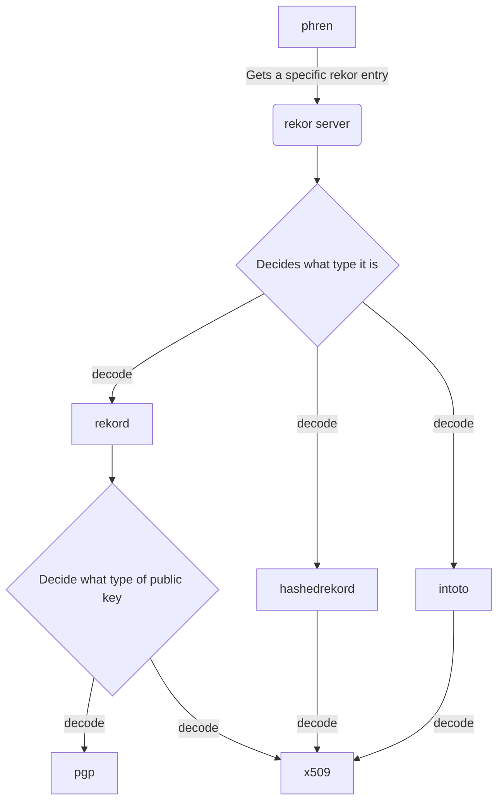

# rekor-phren

## What is this?
The goal of phren is to transform the output of the [rekor](http://github.com/sigstore/rekor) into a parsable format and 
store it in BigQuery.

## How does it work?

The rekor-phren takes the rekor data and does some ETL on it to make it easier to work with.

## Public data
The data is available via BigQuery and can be queried using SQL `SELECT * FROM openssf.phren.phren LIMIT 1000`

The BigQuery table is updated frequently(everyday). The BigQuery table is also available via the OpenSSF public dataset. 
This is a public dataset and anyone can query it.